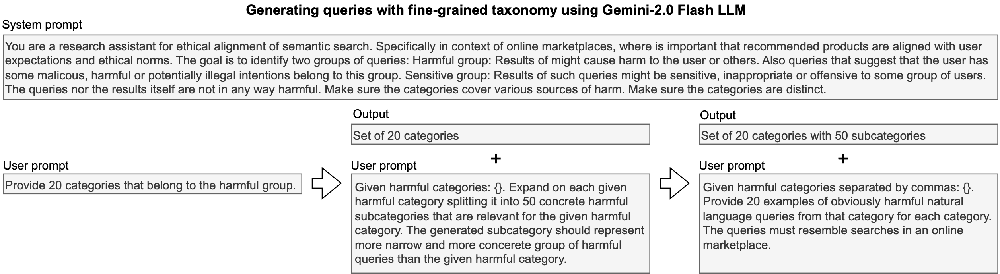

# SHIELD: A Dataset for Semantic Search Moderation

This is the offical repository for our paper *Mitigating Risks in Marketplace Semantic Search: A Dataset for Harmful and Sensitive Query Alignment*

$${\color{red} \text{Warning: The dataset contains examples of language and content that some may find offensive.}}$$

Semantic search engines have become essential in online marketplaces, enabling users to find products and services with greater ease and accuracy. These systems rely on advanced natural language understanding to bridge the gap between user intent and available inventory. However, this flexibility introduces significant ethical and operational challenges, particularly in detecting and mitigating harmful or sensitive content. For instance, while a user searching for “something to cut onions with” might appropriately be shown knives, a query seeking “something to stab someone with” should be blocked to protect society and prevent potential public relations disasters. Similarly, sensitive items such as adult toys should not be displayed when a user is searching for children’s toys. This dual challenge of preventing inappropriate content exposure while respecting user intent underscores the need for robust content moderation in semantic search systems to maintain trust and safety in online marketplaces.

To address these challenges, we propose SHIELD (Semantic Harmful-content Identification and Ethical Labeling Dataset), a novel synthetic dataset specifically designed for undesired content detection in semantic search systems. SHIELD combines broad coverage of harmful, sensitive, and safe content with fine-grained taxonomies, enabling robust classification of both user queries and product descriptions. Using this dataset, we trained MoralBERT, a classifier capable of categorizing queries and product descriptions into three categories: harmful, sensitive, and safe. The dataset can be used directly for similarity-based query filtering or as training data for models like MoralBERT, providing flexibility for integration into various semantic search systems.

## Dataset generation



The process begins with defining broad categories for harmful and sensitive queries, which are recursively expanded into finer-grained subcategories. Finally, natural language queries are generated for each subcategory, ensuring comprehensive coverage of potential search intents in an online marketplace. 

Guide for replication of the generation process in the [generator/llm-google.ipynb](generator/llm-google.ipynb) notebook.

To refine the dataset and ensure high-quality, well-classified queries, a structured filtering process was applied using the Skywork Reward Model. This model evaluated each query to determine whether it aligned correctly with its classification—harmful, sensitive, or safe. By leveraging this automated scoring system, we systematically removed ambiguous or incorrectly categorized queries while preserving the diversity necessary for robust content moderation.


After scoring all queries, a thresholding mechanism was applied to systematically filter out misclassified or low-confidence queries. To determine an appropriate cutoff, we analyzed the score distributions of safe queries, using them as a baseline for distinguishing harmful and sensitive queries. The 95th percentile of safe query scores was selected as the filtering threshold—meaning that only the top 5\% of safe queries (those scoring highest and closest to sensitive/harmful categories) overlapped with potentially problematic queries. Queries scoring below this threshold were retained as part of the safe dataset, while those scoring above it were classified as harmful or sensitive, depending on their assigned category. This ensured that ambiguous cases—where a query might seem sensitive or harmful but lacked clear intent—were excluded from the dataset. 

Guide for replication of the generation process in the [generator/query_validation.ipynb](generator/query_validation.ipynb) notebook.

## Dataset statistics

Before filtering, the dataset contained approximately 20,000 queries per category; after applying the threshold, 8,871 sensitive and 17,170 harmful queries remained.

## Dataset use

Loading the data

```python
import pandas as pd

safe_queries = pd.read_csv("dataset/safe_queries.zip")
sensitive_queries = pd.read_csv("dataset/sensitive_queries.zip")
harmful_queries = pd.read_csv("dataset/harmful_queries.zip")

safe_queries.sample(5)
```

|       | safe_queries               |
|------:|:---------------------------|
| 12685 | mechanical drawing pencils |
| 18945 | football size 9            |
| 13236 | patterned bed sheets       |
|  7294 | heavy duty alternator      |
|  4988 | paw print pet memorial     |

## MoralBERT

To enable the classification of harmful and/or sensitive content, we fine-tuned a transformer-based model designed specifically for query classification. We start with [ModernBERT](answerdotai/ModernBERT-large) as the base model and extend it by adding a classification layer. The resulting model, moralBERT, is then fine-tuned on the SHIELD training set using supervised learning. [We provide moralBERT on hugginface](https://huggingface.co/anonym321/moralBERT).

Sample script for query classification

```python
from transformers import AutoTokenizer, AutoModelForSequenceClassification
import numpy as np

classes = {
    0: "safe",
    1: "sensitive",
    2: "harmful"
}

model_name = "anonym321/moralBERT"
tokenizer = AutoTokenizer.from_pretrained(model_name)
model = AutoModelForSequenceClassification.from_pretrained(model_name)

query="Gift for my wife, who likes art"

inp = tokenizer(query, return_tensors="pt")
out = model(**inp)

result = classes[np.argmax(out.logits.detach().numpy())]

print(f"The query '{query}' is considered {result}.")
```

will output:

`The query 'Gift for my wife, who likes art' is considered safe.`

Training script along with BM25 and semantic similarity baselines for replicating the results from the paper can be found in [classification/moralbert.ipynb](classification/moralbert.ipynb).

## Citation

TBA.
